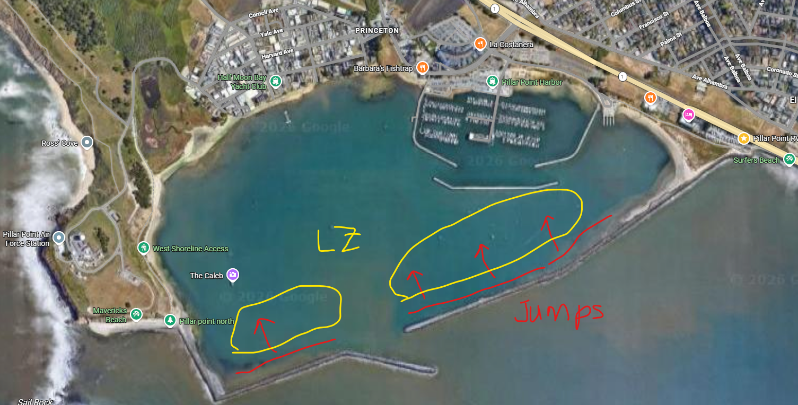

I’ve observed a lot of kiters following a specific etiquette at half moon bay during south wind storm days that works really well, and i wanted to share a post that tries to capture it. 

Hopefully it's just an accurate reflection of the conventions we're all already following, and publicly sharing it may help those who are newer to the spot see the pattern rather than having to learn by inference. The more people that follow this, the safer the spot, and the more opportunities for everyone to go big. This is a proposal to the community... as something we hopefully agree on. Please contribute to this guide (either dm me or send pull requests to github).

Half moon bay during storm season is a rare and special event, happening as few as half a dozen times a year. It's a wonderful way to test your skills in more extreme conditions. Importantly, we all share the water - this is not a gatekeeping post. If you're unsure whether you're ready, Teddy's post (I'll dig up the link) has some great information. Many riders have scored their highest recorded jumps in the bay there, and the glassy flat take offs during strong wind sets this spot apart. This is about the implicit etiquette we seem to have collectively arrived at so that we can all share the water and get the most of our sessions, safely.

To be clear, good judgement always still applies - experienced riders should be mindful of newer riders, only jump when it is safe, right of way can only be yielded, etc. There are plenty of scenarios where the appropriate action would contradict these suggestions. What follows are courtesies we can afford each other and additional safety tips. We're all out there to go big, if we all follow these rules, collectively we get more opportunities to do just that.

- **[Safety] Be aware of what’s happening upwind while you’re in the landing zone, and clear it as fast as possible.** There is a “landing zone” about 200ft downwind of the entire length of the breaker walls (unlike other sites, there isn't a single designated takeoff spot). While in this area, be extra alert of what’s happening upwind as people travel further distances than at other spots, sometimes over 300ft, so adjust your expectations. Once airborne, the jumper has much less maneuverability, and avoiding downwind obstacles can require evasive steering that can result in crashing - risking injury. be mindful that sometimes putting your kite low and speeding up in the direction you’re already traveling can often be a better and more predictable way to clear their downwind path than performing a U-turn. Give extra space to kiters in the air, as heliloops can sweep a wider arc than you'd expect, and forcing a jumper to forgo a heliloop leads to hard landings.

- **[Safety] Always look over your shoulder before turning.** not just behind you but also upwind for airborne kites. Someone may have taken off right behind you assuming you were going to hold your tack.
- **[Courtesy] Yield to those loading up for a jump.** Lining up speed, a good edge and a gust is a rare but magic feeling - it’s the reason we’re braving storm conditions. Although the downwind rider has right of way, if you’re in the landing zone and see someone upwind in the glassy flats riding at speed and building power, evaluate whether you could yield to give them a clear landing zone. Having the stars align on a jump is the thrill we're chasing, and takes priority over getting back upwind after a jump. They’re likely waiting for a gust to hit, so their take off location is unpredictable - keep an eye on them if you're downwind - this may mean slowing down or speeding up depending on your relative positions.
- **[Courtesy] Share the flats with people who jump the opposite stance from you.** While regular is more common than goofy, try to keep tabs on the goofy jumpers (right foot forward).
- **[Courtesy] Don't short tack.** Unlike other spots like the islands at sherman which have clear take-off spots, there isn't a clear rotation / queue at half moon bay. The entire breaker wall serves as a flat water takeoff. This makes slotting in a little harder to describe, but if you're tacking up wind, don't cut off someone who's already up wind and locked in, riding with speed loading for a jump. You can bear off slightly and slot in behind.

Several other spots around the world have specific rules e.g. Dolphin beach, which is part of the motivation and precedent for this suggestion.

